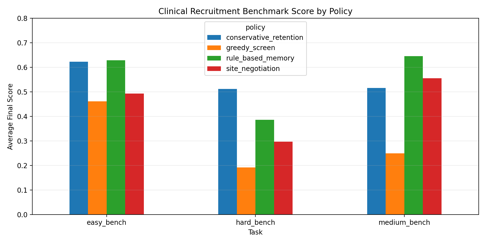
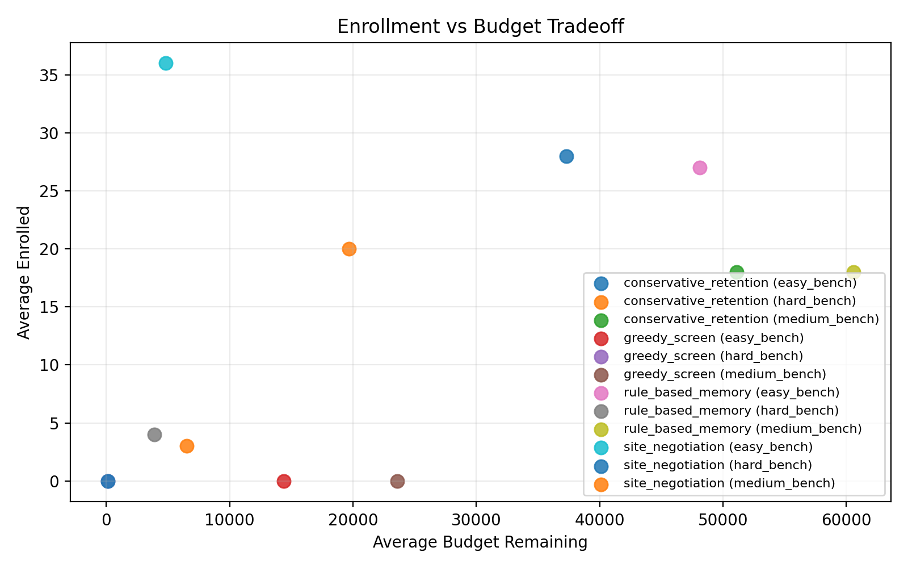
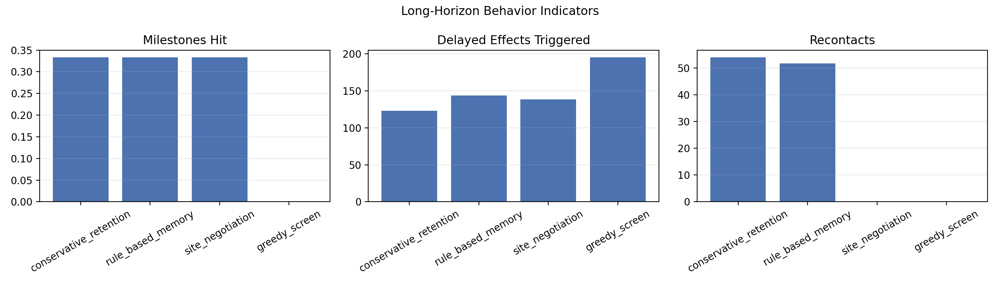
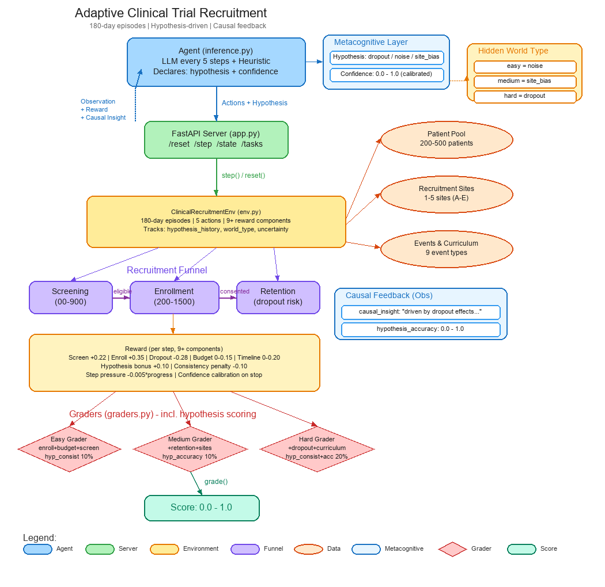

# Adaptive Clinical Trial Recruitment Environment

> A long-horizon, non-stationary sequential decision environment where agents optimize the entire patient recruitment funnel (screening → enrollment → retention) under uncertainty, budget, time pressure, and site variability.

## Why Clinical Trial Recruitment?

**80% of clinical trials fail to meet enrollment deadlines**, costing pharma companies $600K–$8M per day of delay. This environment directly models the #1 trial failure reason — recruitment delays — making it one of the highest real-world utility OpenEnv submissions.

## Domain

Agents manage the full recruitment pipeline for a clinical trial:
1. **Screening** — evaluate candidate patients for eligibility
2. **Site Allocation** — assign consented patients to optimal recruitment sites
3. **Strategy Adjustment** — adapt outreach, criteria strictness, site focus, and site negotiation
4. **Retention** — manage dropout risk through the trial period
5. **Long-Horizon Recovery** — react to delayed effects, milestone pressure, and regulatory or operational constraints

## Episode Structure

- **180 steps** = 180-day clinical trial recruitment period
- Non-stationary patient quality with increasing uncertainty
- Pre-computed deterministic traces (reproducible with fixed seeds 42, 123, 777)
- Curriculum injections (hard bench): periodic easy-pool resets to test generalization
- Delayed consequences: consent windows can expire, outreach waves land later, site negotiations resolve later
- Active constraints: regulatory holds, sponsor pressure, site bottlenecks, competitor pressure, protocol drift
- Progress milestones: 25%, 50%, 75%, and 100% enrollment checkpoints

## Tasks (Easy → Medium → Hard)

| Task | Description | Sites | Budget | Target | Key Challenge |
|------|-------------|-------|--------|--------|---------------|
| `easy_bench` | Stable patient pool, low dropout | 1 | $120K | 80 | Learn basic funnel |
| `medium_bench` | Moderate uncertainty, site variance | 3 | $150K | 120 | Multi-site optimization |
| `hard_bench` | High dropout, curriculum injections | 5 | $100K | 150 | Multi-objective under pressure |

## Action Space

| Action | Description | Cost |
|--------|-------------|------|
| `screen_patient` | Run screening on a candidate | $600–900 |
| `recontact` | Re-engage dropped-interest patient | $100–200 |
| `allocate_to_site` | Assign consented patient to site | $1200–1500 |
| `adjust_strategy` | Change outreach/criteria/focus or negotiate a site | $200–400 |
| `stop_recruitment` | End episode early | Free |

## Observation Space (Pydantic Typed)

| Field | Type | Description |
|-------|------|-------------|
| `timestamp` | int | Day since trial start (0–180) |
| `budget_remaining` | float | Remaining budget in dollars |
| `time_to_deadline_days` | int | Days until trial deadline |
| `enrolled_so_far` | int | Current enrollment count |
| `target_enrollment` | int | Target enrollment |
| `current_funnel` | dict | Funnel stage counts |
| `available_patients` | list | Up to 5 candidate patients |
| `site_performance` | dict | Per-site metrics |
| `recent_events` | list | Recent event strings |
| `uncertainty_level` | float | 0.0–1.0 uncertainty |
| `difficulty` | int | 1=easy, 2=medium, 3=hard |
| `dropout_rate_7d` | float | Rolling 7-day dropout rate |
| `screening_backlog` | int | Patients awaiting results |
| `milestones` | dict | Enrollment milestones reached so far |
| `active_constraints` | dict | Live operational constraints and pressure signals |
| `delayed_effects_pending` | int | Count of scheduled effects not yet triggered |
| `uncertainty_components` | dict | Patient/site/policy uncertainty decomposition |
| `patient_memory_summary` | dict | Cohort counts for follow-up, consent, risk, dropout |
| `counterfactual_hint` | str | Simple environment-generated what-if guidance |

## Reward Function

Per-step reward combines local and long-horizon signals:

1. **Screening success** (+0.30) — patient found eligible
2. **Enrollment gain** (+0.50) — new patient enrolled
3. **Dropout penalty** (-0.35) — patient dropped out
4. **Budget efficiency** — small reward for preserving budget
5. **Timeline bonus** — reward for staying ahead of expected enrollment pace
6. **Curriculum bonus** (+0.18) — exploiting easy-pool resets on hard bench
7. **Milestone bonus** — extra credit when crossing 25/50/75/100% enrollment checkpoints
8. **Hypothesis bonus / consistency penalty** — reward stable correct causal modeling, penalize erratic switching
9. **Commit pressure** — mild time pressure each step plus confidence calibration when stopping early

## Grading (Deterministic, 0.0–1.0)

Each task uses weighted partial-credit grading:

- **Easy**: enrollment rate (40%) + budget efficiency (25%) + screening accuracy (20%) + timeline (15%)
- **Medium**: enrollment (35%) + retention (25%) + site utilization (20%) + budget (20%)
- **Hard**: enrollment (25%) + retention (20%) + budget (20%) + dropout recovery (15%) + curriculum response (10%) + strategy adaptation (10%)

All final task scores are clamped strictly into `(0, 1)` for validator compatibility.

## Baseline Runtime

- `inference.py` uses a **hybrid LLM + heuristic** baseline.
- The baseline now maintains explicit patient memory so it can legally `recontact` and `allocate_to_site` with real patient IDs.
- The runtime consumes long-horizon signals including milestones, active constraints, delayed effects, uncertainty decomposition, and counterfactual hints.
- Offline experiment results are now fed back into serving behavior: `hard_bench` uses a more retention-heavy fallback profile because offline studies showed that strategy outperformed the generic baseline on hard.
- Exact baseline scores depend on the configured model endpoint and deployment state.

## Offline Research Results

The repo now includes a separate offline research stack under `research/`, `experiments/`, `data/`, and `docs/` so benchmark development stays isolated from the serving path.

Default local study: `python experiments/run_research.py --episodes 3`

| Policy | Mean Score Across Tasks |
|------|-------|
| `rule_based_memory` | 0.5603 |
| `conservative_retention` | 0.5500 |
| `site_negotiation` | 0.4487 |
| `greedy_screen` | 0.3013 |

Task-level highlights from the current local run:

- `rule_based_memory` is the strongest overall local baseline, especially on `medium_bench` (`0.6450`).
- `conservative_retention` remains strongest on `hard_bench` (`0.5114`), suggesting the hard task rewards long-horizon retention management more than raw screening volume.
- `site_negotiation` improves medium-task site handling (`0.5554`) but underperforms on hard-task retention.
- `greedy_screen` is a useful short-horizon ablation and confirms that naive screening without memory or conversion management is not sufficient.

### Benchmark Score Comparison



### Enrollment vs Budget Tradeoff



### Long-Horizon Indicators



Research artifacts produced by the local study:

- `data/research_runs.csv`
- `data/research_summary.csv`
- `data/leaderboard.csv`
- `docs/images/benchmark_scores.png`
- `docs/images/enrollment_budget_tradeoff.png`
- `docs/images/long_horizon_indicators.png`

## Research Roadmap

The repo now has a dedicated research-side staging area for paper-inspired long-horizon agents:

- `research/policies.py`: current local baselines used for reproducible offline studies
- `research/methods/registry.py`: paper-to-benchmark mapping for planned research integrations
- `research/methods/README.md`: current status of HCAPO, MiRA, KLong, Plan-and-Act, and MemexRL hooks
- `experiments/run_research.py`: offline experiment CLI
- `scripts/generate_charts.py`: chart-generation pipeline

Current status of named research methods:

- `HCAPO`: planned
- `MiRA`: planned
- `KLong`: planned
- `Plan-and-Act`: partially reflected in the planner/executor-style runtime baseline
- `MemexRL`: planned

These are **not** claimed as implemented paper reproductions yet. The current results and charts come from benchmark-specific local baselines only.

## Novelty

- **Curriculum learning injections**: periodic easy-pool resets mid-episode test agent generalization
- **Non-stationary uncertainty**: patient pool quality degrades over time
- **Multi-site allocation**: sites have different conversion rates, wait times, and capacity
- **Delayed signals and delayed effects**: consent windows, site negotiation, outreach waves, and protocol changes resolve over future steps
- **Constraint-aware planning**: regulatory holds, sponsor pressure, site bottlenecks, competitor pressure, and sentiment pressure change the optimal policy
- **Structured uncertainty decomposition**: observations separate patient-pool, site-operations, and policy uncertainty
- **Patient memory summaries + counterfactual hints**: expose follow-up urgency and alternative next moves without leaking full simulator state
- **No existing similar environment** in the OpenEnv gallery

## Setup

### Local
```bash
pip install -r requirements.txt
uvicorn app:app --host 0.0.0.0 --port 7860
```

### Docker
```bash
docker build -t clinical-recruitment .
docker run -p 7860:7860 clinical-recruitment
```

## API Endpoints

| Method | Path | Description |
|--------|------|-------------|
| GET | `/` | Service info |
| GET | `/health` | Health check |
| POST | `/reset?task_id=easy_bench` | Reset environment |
| POST | `/step` | Take action (JSON body) |
| GET | `/state` | Current state |
| GET | `/tasks` | List available tasks |

## Architecture



```
models.py          → Pydantic data contracts (Observation, Action, Reward, State, StepResult)
load_traces.py     → Deterministic patient pools + events (seeds 42, 123, 777)
env.py             → Core simulation: screening, enrollment, dropout, curriculum
graders.py         → Weighted partial-credit graders (3 tasks)
app.py             → FastAPI server with OpenEnv endpoints
server/app.py      → Server-mode entry point
inference.py       → Hybrid LLM + heuristic baseline agent with patient memory + action normalization
openenv.yaml       → OpenEnv manifest
```
