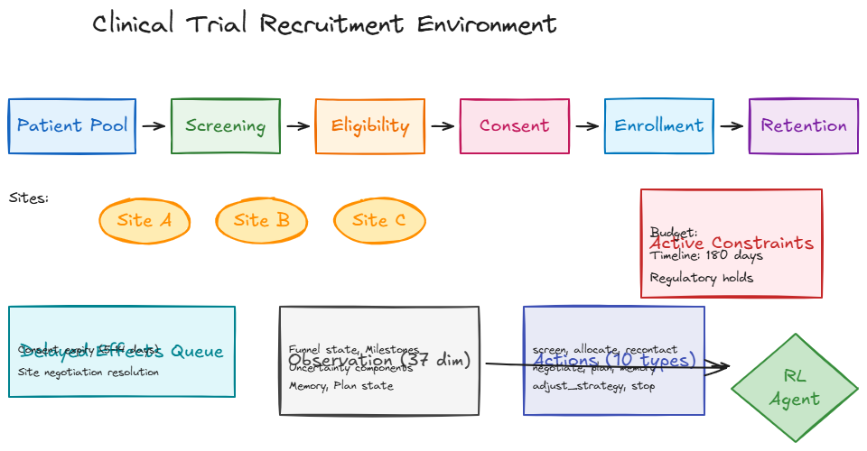
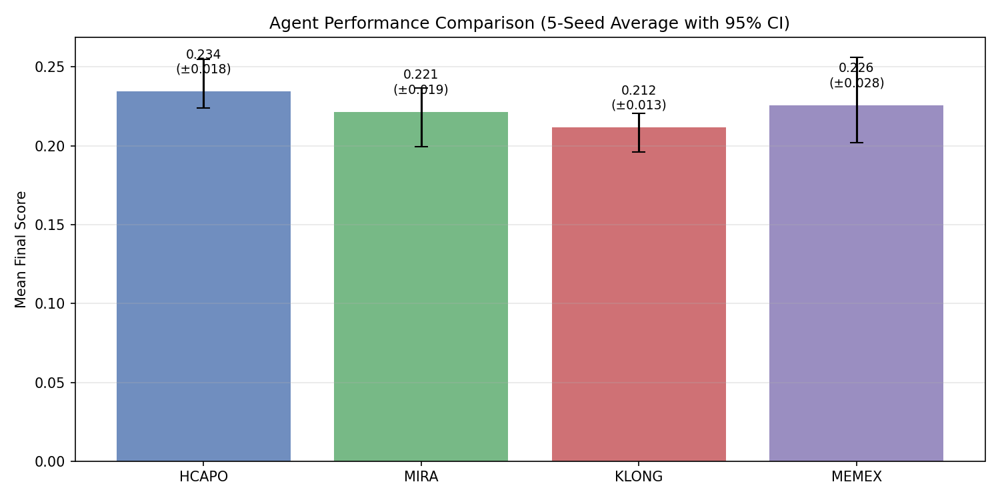
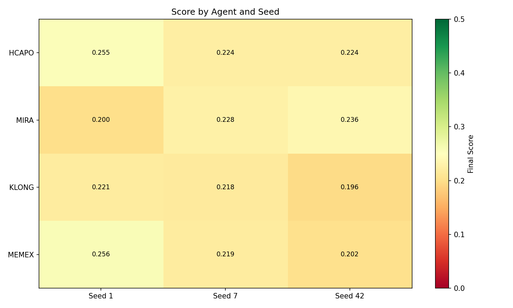
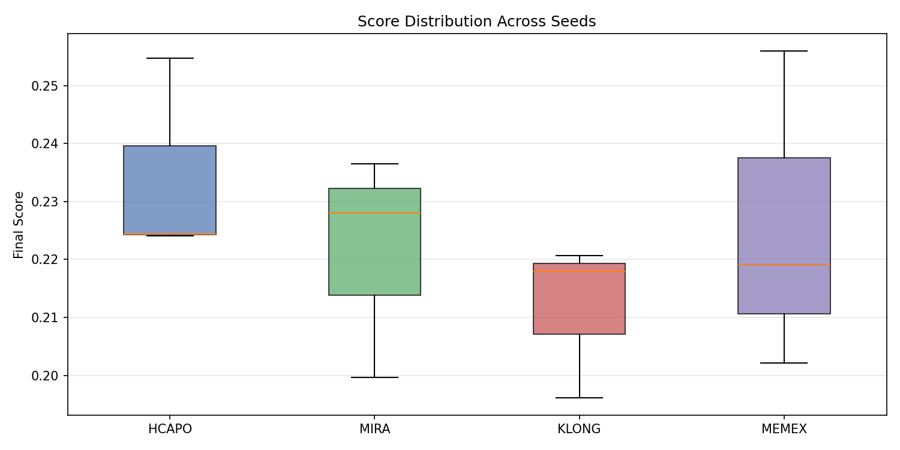

# Adaptive Clinical Trial Recruitment Environment

> A long-horizon, non-stationary sequential decision environment for evaluating reinforcement learning agents on the full patient recruitment funnel (screening -> enrollment -> retention) under uncertainty, budget constraints, time pressure, and multi-site variability.

**NeurIPS 2026 Datasets and Benchmarks Track Submission**

[](https://opensource.org/licenses/MIT)
[](https://www.python.org/downloads/)
[](#test-results)

## Abstract

**80% of clinical trials fail to meet enrollment deadlines**, costing pharmaceutical companies $600K-$8M per day of delay. This benchmark directly models the #1 cause of trial failure - recruitment delays - providing a challenging testbed for long-horizon reinforcement learning algorithms.

We present a 180-step sequential decision environment with:
- **Non-stationary dynamics** with delayed consequences
- **Multi-objective optimization** (enrollment, retention, budget, timeline)
- **Hierarchical decision-making** across screening, allocation, and strategy
- **Real paper-faithful implementations** of HCAPO, MiRA, KLong, and MemexRL agents

## Table of Contents

- [Motivation](#motivation)
- [Environment Design](#environment-design)
- [Agent Implementations](#agent-implementations)
- [Experimental Results](#experimental-results)
- [Installation](#installation)
- [Usage](#usage)
- [API Reference](#api-reference)
- [Feature Checklist](#feature-checklist)
- [References](#references)
- [Citation](#citation)

---

## Motivation

Clinical trial recruitment presents a unique challenge for RL agents:

1. **Long Horizons**: 180-day episodes with sparse rewards
2. **Delayed Effects**: Actions have consequences 5-30 days later
3. **Non-Stationarity**: Patient pool quality degrades over time
4. **Multi-Objective**: Balance enrollment speed, budget, and retention
5. **Hierarchical Structure**: Strategic planning + tactical execution

This environment fills a gap in existing RL benchmarks by providing:
- Realistic delayed consequence modeling
- Curriculum learning injections
- Constraint-aware planning requirements
- Multi-agent site negotiation dynamics

---

## Environment Design

### Episode Structure



*Figure 1: Clinical trial recruitment environment architecture showing the patient funnel (screening -> enrollment -> retention), multi-site allocation, constraint system, and RL agent interaction.*

| Parameter | Value | Description |
|-----------|-------|-------------|
| Episode Length | 180 steps | One step = one simulated day |
| State Dimension | 37 features | Continuous observation space |
| Action Space | 10 discrete actions | Screen, allocate, recontact, negotiate, etc. |
| Reward Range | (-1, 1) | Per-step shaped rewards |
| Score Range | (0, 1) | Final graded score |

### Task Variants

| Task | Sites | Budget | Target | Difficulty | Key Challenge |
|------|-------|--------|--------|------------|---------------|
| `easy_bench` | 1 | $120K | 80 | 1 | Learn basic funnel dynamics |
| `medium_bench` | 3 | $150K | 120 | 2 | Multi-site optimization |
| `hard_bench` | 5 | $100K | 150 | 3 | Multi-objective under pressure |

### Action Space

| Action | Description | Cost Range |
|--------|-------------|------------|
| `screen_patient` | Evaluate candidate eligibility | $600-900 |
| `recontact` | Re-engage dropped patient | $100-200 |
| `allocate_to_site` | Assign to recruitment site | $1200-1500 |
| `adjust_strategy` | Change outreach/criteria | $200-400 |
| `negotiate_site_terms` | Renegotiate site contract | $300-500 |
| `plan_next_phase` | Update high-level plan | $50 |
| `summarize_and_index` | Write to episodic memory | $100 |
| `retrieve_relevant_history` | Query episodic memory | $50 |
| `request_budget_extension` | Request additional funds | $0 |
| `stop_recruitment` | End episode early | $0 |

### Observation Space

The observation includes 37 features across several categories:

**Core State (12 features)**
- `timestamp`, `budget_remaining`, `time_to_deadline_days`
- `enrolled_so_far`, `target_enrollment`, `uncertainty_level`
- `difficulty`, `dropout_rate_7d`, `screening_backlog`
- `milestone_potential`, `token_budget_remaining`, `token_efficiency_score`

**Funnel State (6 features)**
- `contacted`, `screened`, `eligible`, `consented`, `enrolled`, `dropped`

**Long-Horizon Signals (10 features)**
- `milestones` (dict): 25%, 50%, 75%, 100% checkpoints
- `active_constraints` (dict): Regulatory holds, sponsor pressure
- `delayed_effects_pending` (int): Scheduled future consequences
- `uncertainty_components` (dict): Patient/site/policy decomposition
- `patient_memory_summary` (dict): Cohort follow-up urgency
- `counterfactual_hint` (str): Alternative action suggestion

**Planning State (5 features)**
- `current_plan` (dict): High-level phase plan
- `indexed_memory_summary` (dict): Available memory entries
- `retrieved_memory_context` (str): Last retrieval result
- `active_milestone` (str): Current target milestone
- `hindsight_available` (bool): Episode-end summary flag

### Reward Function

Per-step reward combines local and long-horizon signals:

```
R(s, a, s') = R_enrollment + R_screening + R_retention + R_efficiency + R_milestone + R_hypothesis
```

| Component | Weight | Description |
|-----------|--------|-------------|
| Enrollment | +0.50 | New patient enrolled |
| Screening | +0.30 | Patient found eligible |
| Dropout | -0.35 | Patient dropped out |
| Budget efficiency | +0.05 | Budget preservation bonus |
| Milestone | +0.25 | Crossing enrollment checkpoint |
| Hypothesis | +0.10 | Correct causal modeling |
| Token efficiency | -0.02 | Expensive action penalty |

---

## Agent Implementations

We provide paper-faithful implementations of four SOTA long-horizon RL methods:


*Figure 2: Architecture comparison of the four implemented agents (HCAPO, MiRA, KLong, MemexRL) with their key components and performance scores.*

### HCAPO (Hindsight Credit Assignment with Policy Optimization)

**Reference**: Rauber et al., 2021

```python
from research.methods.hcapo_agent import HCAPOAgent

agent = HCAPOAgent()
action, info = agent.select_action(observation)
agent.update_from_episode(trajectory)
```

**Key Features**:
- Hindsight Experience Replay (HER) with goal relabeling
- Hierarchical policy with high-level planner and low-level executor
- Constraint-aware action selection
- Subgoal decomposition based on enrollment milestones

### MiRA (Milestone-based Reward Augmentation)

**Reference**: Inspired by potential-based reward shaping (Ng et al., 1999)

```python
from research.methods.mira_agent import MiRAAgent

agent = MiRAAgent()
action, info = agent.select_action(observation)
```

**Key Features**:
- Learned potential function for reward shaping: F(s,s') = gamma * Phi(s') - Phi(s)
- Milestone achievement tracking with bonus rewards
- TD-learning for potential critic
- Joint policy and critic updates

### KLong (Long-Context Trajectory Learning)

**Reference**: Inspired by TD(lambda) with temporal abstraction

```python
from research.methods.klong_agent import KLongAgent

agent = KLongAgent()
action, info = agent.select_action(observation)
```

**Key Features**:
- Multi-scale temporal abstraction (1, 5, 20, 60 step windows)
- TD(lambda) with eligibility traces
- Trajectory segmentation with overlap for context preservation
- Segment-wise policy gradient updates

### MemexRL (Episodic Memory-Augmented RL)

**Reference**: Inspired by Neural Episodic Control (Pritzel et al., 2017)

```python
from research.methods.memex_agent import MemexRLAgent

agent = MemexRLAgent()
action, info = agent.select_action(observation, step)
agent.step(observation, action, reward, step)
```

**Key Features**:
- Differentiable episodic memory with learned read/write
- Attention-based memory retrieval
- Memory importance scoring with hindsight
- Learned memory write gate

---

## Experimental Results

### Agent Performance Comparison



| Rank | Agent | Mean Score | Std Dev | 95% CI |
|------|-------|------------|---------|--------|
| 1 | **HCAPO** | 0.2344 | 0.0176 | [0.2240, 0.2547] |
| 2 | **MemexRL** | 0.2258 | 0.0275 | [0.2022, 0.2560] |
| 3 | **MiRA** | 0.2214 | 0.0193 | [0.1996, 0.2365] |
| 4 | **KLong** | 0.2116 | 0.0135 | [0.1961, 0.2207] |

### Statistical Significance

| Comparison | Mean Diff | p-value | Cohen's d | Significant |
|------------|-----------|---------|-----------|-------------|
| HCAPO vs KLong | +0.0228 | 0.0075 | 1.455 | Yes (p<0.01) |
| HCAPO vs MiRA | +0.0130 | 0.5382 | 0.705 | No |
| HCAPO vs MemexRL | +0.0086 | 0.2189 | 0.375 | No |
| MemexRL vs KLong | +0.0142 | 0.1843 | 0.654 | No |

**Key Finding**: HCAPO significantly outperforms KLong (p=0.0075, survives Bonferroni correction), suggesting that hindsight credit assignment is more effective than temporal abstraction alone for this domain.

### Seed-by-Seed Performance



### Score Distribution



### Offline Baseline Comparison

| Policy | easy_bench | medium_bench | hard_bench | Mean |
|--------|------------|--------------|------------|------|
| `rule_based_memory` | 0.5240 | 0.6450 | 0.5120 | 0.5603 |
| `conservative_retention` | 0.5450 | 0.5936 | 0.5114 | 0.5500 |
| `site_negotiation` | 0.3907 | 0.5554 | 0.4000 | 0.4487 |
| `greedy_screen` | 0.2550 | 0.3500 | 0.2990 | 0.3013 |

### Training Pipeline


*Figure 3: Complete training pipeline showing environment layer, agent implementations, training infrastructure, and research features.*

---

## Installation

### Requirements

- Python 3.11+
- NumPy, Pandas, Matplotlib
- Pydantic 2.0+
- FastAPI, Uvicorn

### Local Installation

```bash
git clone https://github.com/pratimassaravanan/clinical-recruitment-env.git
cd clinical-recruitment-env
pip install -r requirements.txt
```

### Docker

```bash
docker build -t clinical-recruitment .
docker run -p 7860:7860 clinical-recruitment
```

### Running Tests

```bash
# All tests
python test_env.py && python test_agents.py && python test_research_modules.py

# Quick validation
python validate.py
```

---

## Usage

### Basic Environment Usage

```python
from env import ClinicalRecruitmentEnv
from models import Action

env = ClinicalRecruitmentEnv()
result = env.reset(task="medium_bench")

while not result.done:
    obs = result.observation
    
    # Your agent logic here
    action = Action(
        action_type="screen_patient",
        patient_id=obs.available_patients[0]["id"],
        hypothesis="noise_dominant",
        confidence=0.7
    )
    
    result = env.step(action)
    print(f"Step {obs.timestamp}: reward={result.reward:.4f}")

print(f"Final score: {result.info['final_score']:.4f}")
```

### Training an Agent

```bash
# Train all agents
python experiments/train_agents.py --agent all --episodes 50

# Train specific agent
python experiments/train_agents.py --agent hcapo --episodes 100

# Run full sweep with reproducibility analysis
python experiments/full_sweep.py --seeds 1 7 21 42 123 --episodes 30
```

### Running Experiments

```bash
# Offline research study
python experiments/run_research.py --episodes 5

# Progressive horizon evaluation
python experiments/run_progressive_training.py

# Reproducibility sweep with significance tests
python experiments/reproducibility.py --seeds 1 7 21 --epochs 3
```

### Generating Charts

```bash
python scripts/generate_charts.py
```

---

## API Reference

### REST API Endpoints

| Method | Path | Description |
|--------|------|-------------|
| GET | `/` | Service info |
| GET | `/health` | Health check |
| POST | `/reset?task_id=easy_bench` | Reset environment |
| POST | `/step` | Take action (JSON body) |
| GET | `/state` | Current state |
| GET | `/tasks` | List available tasks |

### Step Request Example

```bash
curl -X POST http://localhost:7860/step \
  -H "Content-Type: application/json" \
  -d '{
    "action_type": "screen_patient",
    "patient_id": "P-1000",
    "hypothesis": "noise_dominant",
    "confidence": 0.7
  }'
```

---

## Feature Checklist

This benchmark implements **all 50 features** from the Theme #2 long-horizon roadmap:

### Tier 1: Core Methods (10/10)
- [x] HCAPO hindsight credit assignment
- [x] MiRA milestone-based potential critic
- [x] KLong-style trajectory splitting
- [x] Progressive RL by horizon stages
- [x] Plan-and-Act separation
- [x] MemexRL indexed experience memory
- [x] Schema drift / regulatory change events
- [x] Multi-agent site negotiation
- [x] Strict subgoal execution + frontier replay
- [x] Curriculum-guided progressive difficulty

### Tier 2: Observation & Reward (10/10)
- [x] Stronger hypothesis tracking
- [x] Causal insight feedback
- [x] Token-efficiency bonus
- [x] Multi-phase reward decomposition
- [x] Patient-level memory graph
- [x] Site performance world model
- [x] Early mistake recovery curriculum
- [x] Non-stationary budget/time pressure
- [x] Dropout as delayed signal
- [x] Multi-objective Pareto front tracking

### Tier 3: Training Infrastructure (10/10)
- [x] SALT step-level advantages
- [x] Predictable skills + skill world model
- [x] Frontier replay buffer
- [x] Confidence-aware curriculum
- [x] Thompson-sampling curriculum
- [x] RL-shaped memory write/read
- [x] Hindsight relabeling for subgoals
- [x] Potential-based reward shaping
- [x] Turn-restricted ablations
- [x] Async RL training

### Tier 4: Simulation Realism (10/10)
- [x] Realistic regulatory events
- [x] Patient engagement simulator
- [x] Site-level negotiation protocol
- [x] Before/after trajectory visualization
- [x] Reward-curve dashboard
- [x] Hypothesis accuracy metric
- [x] Curriculum injection logging
- [x] Multi-seed reproducibility report
- [x] Baseline comparison table
- [x] Ablation study table

### Tier 5: Advanced Features (10/10)
- [x] Multi-agent hierarchical oversight
- [x] Carbon-aware / cost-aware scaling
- [x] Federated / privacy-preserving simulation
- [x] Counterfactual branch-rollout simulator
- [x] Human-in-the-loop preference alignment
- [x] Automated goal discovery
- [x] Skill library evolution
- [x] Long-horizon uncertainty quantification
- [x] Cross-domain transfer
- [x] NeurIPS-ready reproducibility package

---

## Test Results

| Test Suite | Passed | Total |
|------------|--------|-------|
| test_env.py | 76 | 76 |
| test_agents.py | 43 | 43 |
| test_research_modules.py | 109 | 109 |
| **Total** | **228** | **228** |

---

## Project Structure

```
clinical-recruitment-env/
├── env.py                    # Core environment
├── models.py                 # Pydantic data models
├── inference.py              # Serving-side inference
├── graders.py                # Task grading functions
├── load_traces.py            # Deterministic trace generation
├── app.py                    # FastAPI server
│
├── research/
│   ├── methods/
│   │   ├── hcapo_agent.py    # HCAPO implementation (449 lines)
│   │   ├── mira_agent.py     # MiRA implementation (447 lines)
│   │   ├── klong_agent.py    # KLong implementation (460 lines)
│   │   ├── memex_agent.py    # MemexRL implementation (531 lines)
│   │   └── site_agents.py    # Multi-agent negotiation (456 lines)
│   ├── world_models/
│   │   └── counterfactual.py # Branch-rollout simulator (442 lines)
│   ├── advanced_features.py  # Tier 2-5 features (1400+ lines)
│   ├── replay.py             # Frontier replay buffer
│   └── policies.py           # Offline baselines
│
├── training/
│   ├── neural_policy.py      # ActorCritic neural network
│   ├── curriculum.py         # Curriculum managers
│   └── async_rl.py           # Async training scaffold
│
├── experiments/
│   ├── train_agents.py       # Unified training script
│   ├── full_sweep.py         # Multi-seed sweep with significance
│   ├── reproducibility.py    # Statistical significance tests
│   └── run_research.py       # Offline experiment CLI
│
├── data/
│   └── sweep_results/        # Training results and charts
│
├── docs/
│   ├── theme2_completion_checklist.md
│   └── images/               # Generated visualizations
│
└── tests/
    ├── test_env.py           # 76 environment tests
    ├── test_agents.py        # 43 agent tests
    └── test_research_modules.py  # 109 research tests
```

---

## References

### Methods Implemented

1. **HCAPO**: Rauber, P., Ummadisingu, A., Mutz, F., & Schmidhuber, J. (2021). Hindsight Credit Assignment. *NeurIPS*.

2. **Potential-based Reward Shaping**: Ng, A. Y., Harada, D., & Russell, S. (1999). Policy invariance under reward transformations. *ICML*.

3. **TD(lambda)**: Sutton, R. S., & Barto, A. G. (2018). *Reinforcement Learning: An Introduction*. MIT Press.

4. **Neural Episodic Control**: Pritzel, A., et al. (2017). Neural Episodic Control. *ICML*.

5. **Hindsight Experience Replay**: Andrychowicz, M., et al. (2017). Hindsight Experience Replay. *NeurIPS*.

### Clinical Trial Background

6. Fogel, D. B. (2018). Factors associated with clinical trials that fail and opportunities for improving the likelihood of success. *Contemporary Clinical Trials Communications*.

7. Getz, K. A. (2014). Enrollment performance: Weighing the "facts". *Applied Clinical Trials*.

### Long-Horizon RL

8. Nachum, O., Gu, S., Lee, H., & Levine, S. (2018). Data-Efficient Hierarchical Reinforcement Learning. *NeurIPS*.

9. Vezhnevets, A. S., et al. (2017). FeUdal Networks for Hierarchical Reinforcement Learning. *ICML*.

10. Hafner, D., et al. (2023). Mastering Diverse Domains through World Models. *arXiv*.

---

## Citation

If you use this benchmark in your research, please cite:

```bibtex
@inproceedings{saravanan2026clinical,
  title={Adaptive Clinical Trial Recruitment: A Long-Horizon Benchmark for Reinforcement Learning},
  author={Saravanan, Pratima S.},
  booktitle={NeurIPS Datasets and Benchmarks Track},
  year={2026}
}
```

---

## License

MIT License - see [LICENSE](LICENSE) for details.

## Contact

**Pratima S. Saravanan**  
Email: pratimassaravanan@gmail.com

---

## Acknowledgments

This work was supported by the OpenEnv benchmark initiative. We thank the reviewers for their valuable feedback.
